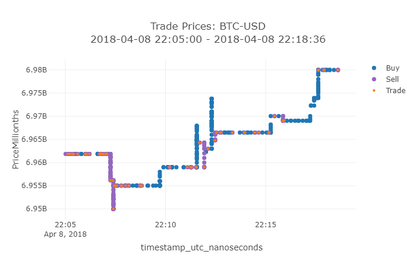
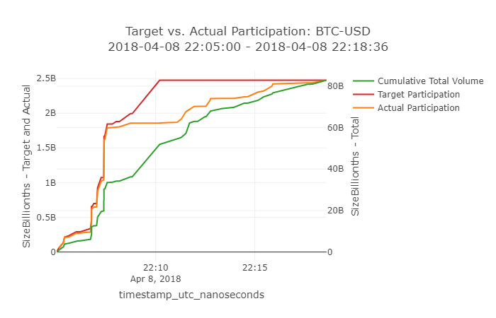
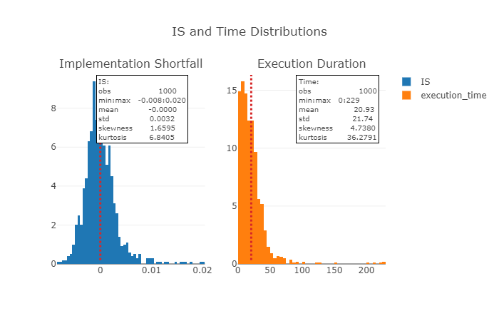

# FINM33150 - Accumulation Opportunity

## Dependencies

Create a virtual environment and install dependencies with

    pipenv install

## Summary
For this assignment we assess the feasibility of accumulating large positions while attempting to maintain low trading
costs in an electronic market.

The objective of this analysis is to describe the dynamics of position accumulation and liquidation strategies. The analysis is based on marked millisecond tick-level data for BTC-USD from 
2018-03-31 03:34:51 to 2018-04-11 06:06:52 (579,826 obs) and 2021-04-11 02:28:52 to 2021-04-21 05:17:13 (3,777,963 obs) and a simple execution model with the following key parameters:
* Arrival time (timestamp)
* Position size (shares)
* Target participation rate (%) - target % of total market volume to trade
* Max trade participation rate (%)- maximum % of volume of qualified transactions to participate in
* Chunk size (shares)- Increments of total market volume in which increases in target participation are determined
* Price window (ms) - Duration of look-ahead window for purposes of adhering to constraint of transacting at least favorable prices

The model works by starting at an arrival date and then establishing a target participation level based on the number of chunks of total market volume that have traded. If traded volume to date is less than targeted participation, trades are participated in on the appropriate side, with size capped as a percentage of the aggregate volume traded on a millisecond basis and price based on the least favorable price within a set number of milliseconds.

We then execute strategies at randomly determined arrival times and characterize their dynamics in terms of:
* Expected value of implementation shortfall (%) - shortfall in volume weighted average price as a percentage of the market price at arrival time. Note that we follow a convention that a negative IS indicates a diminution in value.
* Standard deviation of implementation shortfall (%)
* Expected value of execution duration (minutes)
* Standard deviation of execution duration (minutes)

### Constraints
* Have to trade a least favorable price within price window
* Must evaluate positions of consequence
* Target total execution time of 1 to 15 minutes

Trading costs are not included in the analysis as they would have been modeled as a linear function of traded value and as such would not have resulted in relative differences between the strategies evaluated. I believe Almgren and Chriss assume that there is no fixed component of trading costs, such that trading zero shares results in zero trading costs.

### Experiments
* We conduct two experiments and compare them to a baseline set of model parameters.
* The first is a reduction in execution duration effected by reducing position size, effectively executing the same initial trades as would be executed in the baseline case.
* The second is a reduction in execution duration effected by increasing the maximum allowable participation in individual trades.
* Both of these experiments showed statistically insignificant reductions in expected value and variance

### Further research
Without modelling the impact on price of trade size, our model fails to capture a critical driver of the real world impacts of trade offs between changes in execution duration and trade sizes.
* Develop model for temporary and permanent impact ala Almgren and Chriss
    * Temporary could be just taking large trades on either side and regressing size (what should the units be?) against change in price
    * Permanent would be more complicated - something along the lines of a multiple regression of aggregate marked trades for each side against total change in price with longer aggregation periods
* Implement Almgren and Chriss optimal schedule

### Trade Prices

### Participation

### Distributions
